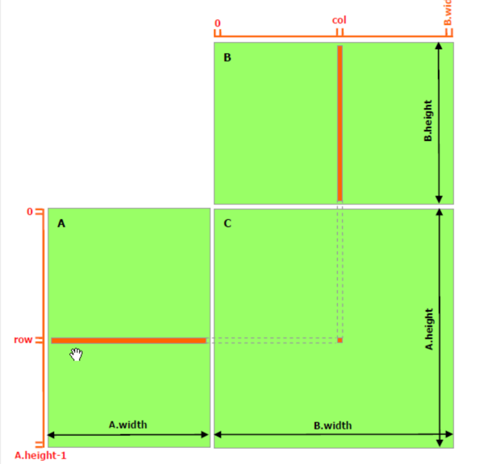
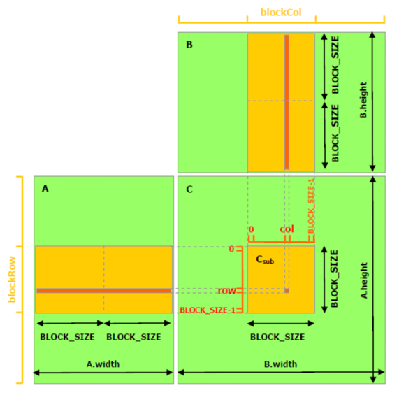

## implement GEMM(general matrix multiply) with CUDA

### introduction
$ A (M \times k)$, $B (K \times N)$,  $C (M \times N)$

$ C = \alpha \times A\dot B + \beta \times C$
### gemm_v1
block$(32, 32)$ have 1024 thread, grid$((M-1)/32+1, (N-1)/32+1)$

### gemm_v2_32x32
pointer(A, B, C) minus offset to avoid branches in the loop.
and saving threadIdx.

### gemm_v3_32x32
using shared memory for local tile A(32x32), B(32x32) to optimize time of visiting global memory.
visit global memory costs hundreds of clocks， but shared memory in the chip only cost tens of clocks.

### gemm_v4_32x32
add padding in the shared memory to deal with bank conflict.
1 thread computation 1 element.

### gemm_v5_32x32
GPU support 128bit accelerating for vectorizaion. 128bit = float4 = double2.
we can speed up arithmetic intensity by reading data simultaneously with float4.
1 thread computes 4 element.

### gemm_v6_64x64
1 block computes local tile C(64x64), load local tile A(64x16), B(16x64).
1 thread computes 4x4 local tile.

### gemm_v7_128x128
brutally combine 4 (64x64 tile) into 128x128 tile.
1 block computes local tile C(128x128), load local tile A(128x8), B(8x128).
1 thread computes 8*8 local tile.

